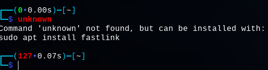
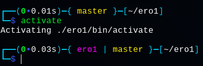
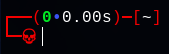

# NucleusOS - Debian based

## Bugs
If you are getting errors (like apt upgrade failing),
see scripts in the *~/.config/fixes* folder for possible fixes.

## Encryption (LUKS)
When choosing to encrypt a partition in the debian installer, on first boot you will land in busybox because of incomplete /etc/crypttab.\
Steps to fix:

1. `blkid` and isolate which partition is of **TYPE="crypto_LUKS"** (ex: */dev/sda5*)\
    `<luks_partition>` is /dev/sda5\
    `<partition_name>` is sda5
2. `cryptsetup luksOpen <luks_partition> <partition_name>_crypt`
3. `exit`
4. Login with the default password
5. Open a terminal with the keyboard shortcut 'Win+Enter', then 'Enter' to finalize setup
6. `sudo update-initramfs -k all -u`
7. If the previous step failed with a '*target not found in /etc/crypttab*':\
    `label="$(cat /etc/crypttab | grep luks | awk '{printf $1;}')"; echo ${label%_crypt}`,\
    then repeat the steps using this value as `<partition_name>`

## I3wm  
i3wm is a dynamic window manager for X11, designed for efficiency and simplicity.  
Config stored in **`~/.config/i3/config`**
&nbsp;  

---

### Keyboard Shortcuts
**Mod key** : Win key  

|Action|Shortcut|Line responsible|
|------|--------|----------------|
|**Open terminal**|`Win+Enter`|`bindsym $mod+Return exec i3-sensible-terminal`|
|**Close window**|`Win+Shift+a`|`bindsym $mod+Shift+a kill`|
|**Shortcut launcher (rofi)**|`Win+d`|`bindcode $mod+40 exec "rofi -modi drun,run -show drun"`|
|**Resize window**|`Win+r`,`arrow keys`|`bindsym $mod+r mode "resize"`|
|**Enter/Exit fullscreen**|`Win+f`|`bindsym $mod+f fullscreen toggle`|
|**Switch workspace**|`Win+<digit>`|`bindsym $mod+<digit code> workspace number $ws<digit>`|
|**Move window in workspace**|`Win+Shift+<arrow keys>`|`bindsym $mod+Shift+<direction>`|
|**Move window across workspaces**|`Win+Shift+<digit>`|`bindsym $mod+Shift+<digit code> move container to workspace number $ws<digit>`|
|**Set horizontal opening**|`Win+h`|`bindsym $mod+h split h`|
|**Set vertical opening**|`Win+v`|`bindsym $mod+v split v`|
|**Reload i3 configuration**|`Win+Shift+r`|`bindsym $mod+Shift+r restart`|
|**Lock session**|`Win+Escape`|`bindsym $mod+Escape exec --no-startup-id i3lock -nef -i <lockscreen wallpaper path>`|
|**Logout**|`Win+Shift+e`,`Win+l`|`bindsym $mod+l exec killall -u "$USER"`|
|**Reboot**|`Win+Shift+e`,`Win+r`|`bindsym $mod+r exec systemctl reboot`|
|**Shutdown**|`Win+Shift+e`,`Win+s`|`bindsym $mod+s exec systemctl poweroff`|  

More infos at [https://i3wm.org/docs/userguide.html#_default_keybindings](https://i3wm.org/docs/userguide.html#_default_keybindings "Default Keybindings")

---

### Autostarted with i3
|Action|Line responsible|
|------|----------------|
|Set Modifier key|`set $mod Mod4`|
|Launch bluetooth systray icon|`exec --no-startup-id blueman-applet`|
|Launch NetworkManager systray icon|`exec --no-startup-id nm-applet`|
|Resize lockscreen wallpaper|`exec --no-startup-id mogrify -resize $(xrandr \| grep "*" \| awk '{ print $1 }' \| head -n 1)! <wallpaper path>`|
|Disable screen saver/timeout|`exec --no-startp-id xset s off && xset s noblank && xset -dpms`|
|Launch transparent/blurred background|`exec_always --no-startup-id picom --experimental-backend -b`|
|Set Wallpaper|`exec_always --no-startup-id feh --bg-fill <wallpaper path>`|
|Launch Polybar|`exec_always --no-startup-id ~/.config/polybar/launch.sh`|

&nbsp;

## Multiple screen setup
Configure position and resolution of external monitors with ARandR, a graphical front-end for `xrandr`.
- `Win+d`, `ARandR` (with rofi)  
    or
- `arandr` (from terminal)

## PS1
The PS1 is configured inside of the `~/.zshrc` file, in the *`configure_prompt()`* function, displaying :
- Exit code of the last executed command (colored green for success, red otherwise)
- Execution time in seconds
- Name of activated virtual environment if any
- Name of current git branch if any
- Current working directory
- When in superuser shell (su), surrounding color switches from cyan to red

